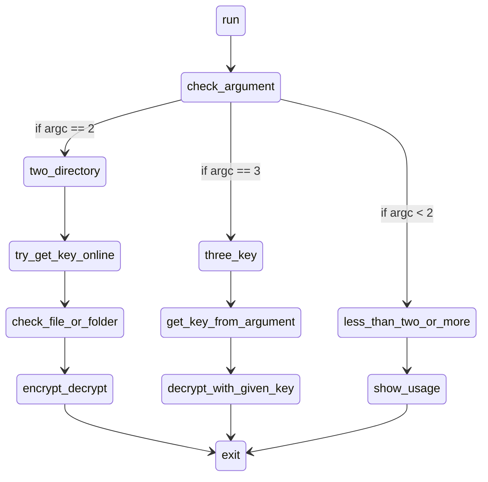

# Ransomware Documentation

> fait par Thomas et Simon

## Introduction

Ce document contient la documentation ainsi que la façon sur comment utiliser le ransomware. Veuillez noter qu'un ransomware est un programme malveillant et qu'il est donc fortement déconseillé de l'utiliser sans connaissance du fonctionnement du programme.

C'est un programme qui à été créé dans un but éducatif, nous révoquons également toutes responsabilités quand à l'usage que vous pourriez en faire.

## Qu'est-ce qu'un ransomware 

Un ransomware est un programme malveillant ayant pour but de couper l'accès à certaines données en les chiffrant afin que la personne exécutant le ransomware ne puisse plus y accéder. Le but est souvent de soutirer de l'argent en échange de la récupération de données, même si parfois, malgré le fait que la victime paye, la clef de déchiffrement ne sera jamais envoyée.

Le système de chiffrement utilisé est souvent symétrique car la vitesse de chiffrement est beaucoup plus rapide que la chiffrement asymétrique qui requière deux clefs et qui est plus lent. Le chiffrement asymétrique est souvent utilisé pour s'envoyer la clef utilisé pour le chiffrement symétrique pour qu'une tierce personne ne puisse pas la récupérer.

Le ransomware utilise aussi souvent le réseau, soit pour se propager, soit pour récupérer des informations (clef, données sensibles, ...) ce qui peut aussi être une faiblesse si l'adresse du serveur est retrouvée, ce qui permettrait de retrouver l'attaquant.

## Fonctionnement global du ransomware

Le ransomware fonctionne comme ceci en ligne de commande : `./ransom <path> [key]`

- `path` est le chemin qui pointe vers le dossier ou le fichier à chiffrer
- `key` la clef si vous voulez déchiffrer un fichier/dossier

## Compiler le programme

Pour compiler le programme, il y a un **Makefile **qui permet de le compiler pour la plateforme de votre choix :

- `make linux` pour compiler pour linux (avec _gcc_)
- `make windows` pour compiler pour windows (avec _mingw_)
- `make server` pour compiler et lancer le serveur pour linux (avec _gcc_)

## Les fonctions du ransomware

les fonctions principales sont :

> __char* getKey();__
>
> ``getKey()`` va essayer de se connecter au serveur de l'attaquant afin de recevoir une clef, si cela échoue, le programme va utiliser une clef qui est directement écrite dans le code (qui sera chiffré avec les autres fichiers lors du processus de chiffrement).

> __int processFile(char* path, const char* key);__
>
> ``processFile(char *path, const char *key)`` reçoit le chemin du fichier à chiffrer ainsi que la clef. La fonction va regardé l'extension du fichier, si celui-ci ne se termine pas par `.st` alors le fichier sera chiffré. 

> __int encDir(char* path, const char* key);__
>
> ``encDir(char* path, const char* key)`` est la fonction principale du programme, c'est elle qui va boucler de manière récursive afin d'envoyer en argument les fichiers à`` processFile()``.

### Fonctions à usage plus basique

> `FILE* openFile(const char* path, const char* mode)`
> ouvre un fichier dans le mode donné en argument et regarde s'il y a des erreurs, retourne un pointer vers la structure du fichier

> `int closeFile(FILE*, FILE*)`
> ferme le fichier d'entrée et de sortie

> `int docrypt(FILE* input, FILE* output, const char* key,int (*)(int, char[], const char*,int*))`
> reçoit un fichier d'entrée et de sortie et utilise la fonction donné en paramètre pour soit chiffrer soit déchiffrer le fichier

> `int encrypt(int n, char[n], const char*, int*)`
> chiffre la chaine de caractère donné en argument

> `int decrypt(int n, char[n], const char*, int*)`
> déchiffre la chaine de caractères donné en argument

> `char* addext(const char* path, const char* ext)`
> ajoute l'extension `.st` au fichier et renvoie le nom du fichier

> `char* remext(const char* input)`
> enlève l'extension `.st` au fichier et renvoie le nom du fichier

> `int isDir(char* path)`
> regarde si le chemin donné pointe vers un dossier ou non

> `char* addPath(const char* path, const char* file)`
> ajoute le chemin d'accès complet au fichier

> `void leaveExplanation()`
> écrit dans `stdout` et dans un fichier `readme` comment récupérer les données.

> `char* net_get(int* ID)`
> reçoit un ID en argument et essaie de se connecter au serveur, s'il n'y arrive pas alors l'ID est mit à 0, renvoie la clef obtenu

> `void send_ID(SOCKET sock, int* ID)`
> envoie l'ID au serveur afin qu'il puisse générer une clef unique

> `char* get_data(SOCKET sock)`
> reçoit la clef du serveur

> `SOCKET set_socket()`
> créer le socket avec les bons paramètres le renvoie

> `SOCKADDR_IN set_addr()`
> paramètres l'adresse ip et le port de destination du socket

> `int bytes_to_hexa(const unsigned char bytes_string[], char *hex_string, int size)`
> converti une chaine de caractères en hexa

> `int hexa_to_bytes(char hex_string[], unsigned char val[], int size);`
> converti un tableau de nombre hexa en chaine de caractères

## Les fonctions du serveur

> `char *gen_key(int ID)`
génère une clef en utilisant l'ID donné en paramètre, renvoie la clef générée

> `void save(int ID, char* key, char* hkey)`
> sauvegarde l'ID et la clef ascci et hexa dans un fichier

> `void handleClients(SOCKET sock)`
> s'occupe d'un client (recevoir l'ID/généré la clef/envoyer la clef)
